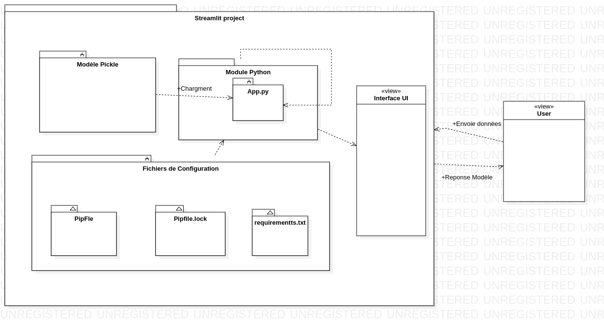
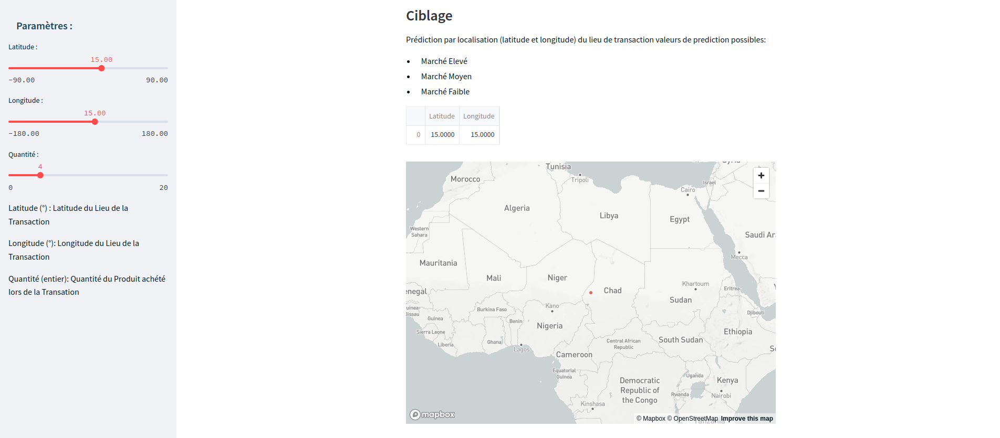
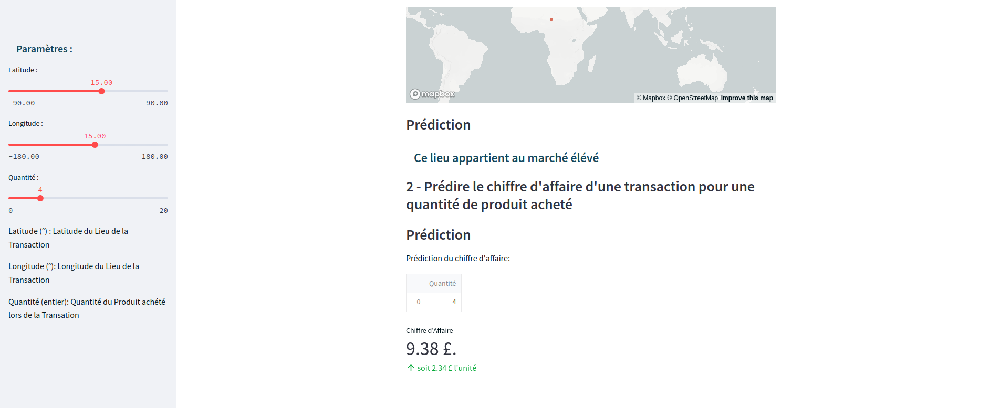

# Customer Segmentation
Application de déploiement de modèle de machine learning basé sur le concept de segmentation du marché.

## pré-requis:

* Python
* streamlit
* pipenv
* pickle 
* scikit learn

---

## Architecutre
 
## Fonctionalités Principales 
* **Cibler le marché** le plus remptable selon le la 
localisation du client lors de la transaction

* **Prédir le chiffre d'affaire** d'une quantité de Transaction d'un produit effectué par un client

# Enrionement de développement

* créer l'environement virtuelle python : `pipenv shell ./`
* installer streamlit 
    * `pip install streamlit` ou
    * `pipenv install streamlit`
* scikit-learn : `python3 -m pip install scikit-learn`
* pickle: `python3 -m pip install pickle5`
* tester streamlit `streamlit hello`
* exécuter app.py `streamlit run app.py`

* dependances : `pip freeze > requirements.txt`
* installer les dependances `pip install -r requirements.txt`

# Liens utiles : 

* Mon Notebook de machine learning : [Customer_Segmentation.ipynb](https://github.com/lmlouis/IntroductionIA/blob/main/Customer_Segmentation.ipynb)
* Steamlit : [streamlit.io](https://streamlit.io/)
  